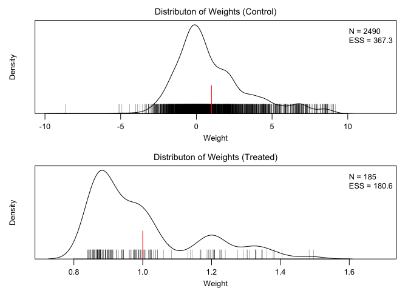

<!-- README.md is generated from README.Rmd. Please edit that file -->

# lmw: Diagnostics for the Implied Weights of Linear Regression

<!--  -->

## <!-- [](https://cran.r-project.org/package=lmw) [](https://cran.r-project.org/package=lmw) -->

### Overview

`lmw` provides diagnostic tools for the implied weights of linear
regression for use in estimating treatment effects in observational
studies under unconfoundedness. When a sufficient set of covariates have
been measured to eliminate confounding, adjusting for them in a
regression model for the outcome with the treatment and covariates as
predictors can be an effective way to isolate the causal effect of the
treatment. The treatment effect resulting from this model can be
represented as a difference between the weighted outcome means in the
treatment groups, similar to inverse probability weighting.

The weights implied by the regression model have several interesting
characteristics: they yield exact mean balance between the treatment
groups for every covariate included in the model, they have minimum
variance among all weights that do so, and they may be negative. Despite
yielding exact mean balance between treatment groups, they may not yield
balance between the treatment groups and the target population
corresponding to the desired estimand; in addition, the negative weights
they produce indicate extrapolation beyond the original covariate space.
`lmw` provides tools to compute the implied weights and perform
diagnostics to assess balance, extrapolation, and influence.

Below is an example of the use of `lmw` to diagnose regression weights
for estimating the average treatment effect on the treated (ATT) of a
job training program on earnings using the Lalonde dataset.

``` r
#Load lmw and the data
library("lmw")
data("lalonde", package = "MatchIt")

#Estimate the weights
lmw.out <- lmw(~ treat + age + educ + race + married + nodegree + re74 + re75,
               data = lalonde, treat = "treat", estimand = "ATT", type = "URI")
```

`lmw.out` contains the implied regression weights. We can see that the
weighted outcome mean difference between the treatment groups is equal
to the coefficient on the treatment in the corresponding outcome
regression model:

``` r
#The weighted difference in means
w <- lmw.out$weights
with(lalonde, 
     weighted.mean(re78[treat == 1], w[treat == 1]) - 
       weighted.mean(re78[treat == 0], w[treat == 0]))
```

    #> [1] 1548.244

``` r
#The coefficient in the corresponding outcome model
fit <- lm(re78 ~ treat + age + educ + race + married + nodegree + re74 + re75,
               data = lalonde)
coef(fit)["treat"]
```

    #>    treat 
    #> 1548.244

How well do the weights do at balancing the treatment groups to the
target population (in the case, the treated sample)?

``` r
(s <- summary(lmw.out))
```

    #> 
    #> Call:
    #> lmw(formula = ~treat + age + educ + race + married + nodegree + 
    #>     re74 + re75, data = lalonde, type = "URI", estimand = "ATT", 
    #>     treat = "treat")
    #> 
    #> Summary of Balance for Unweighted Data:
    #>                SMD TSMD Control TSMD Treated     KS TKS Control TKS Treated
    #> age        -0.3094       0.3094            0 0.1577      0.1577           0
    #> educ        0.0550      -0.0550            0 0.1114      0.1114           0
    #> raceblack   1.7615      -1.7615            0 0.6404      0.6404           0
    #> racehispan -0.3498       0.3498            0 0.0827      0.0827           0
    #> racewhite  -1.8819       1.8819            0 0.5577      0.5577           0
    #> married    -0.8263       0.8263            0 0.3236      0.3236           0
    #> nodegree    0.2450      -0.2450            0 0.1114      0.1114           0
    #> re74       -0.7211       0.7211            0 0.4470      0.4470           0
    #> re75       -0.2903       0.2903            0 0.2876      0.2876           0
    #> 
    #> Summary of Balance for Weighted Data:
    #>            SMD TSMD Control TSMD Treated     KS TKS Control TKS Treated
    #> age         -0      -0.0262      -0.0262 0.2625      0.2547      0.0296
    #> educ        -0       0.0054       0.0054 0.0447      0.0472      0.0395
    #> raceblack   -0      -0.4280      -0.4280 0.0000      0.1556      0.1556
    #> racehispan   0       0.2234       0.2234 0.0000      0.0528      0.0528
    #> racewhite    0       0.3468       0.3468 0.0000      0.1028      0.1028
    #> married     -0       0.0834       0.0834 0.0000      0.0326      0.0326
    #> nodegree    -0      -0.0869      -0.0869 0.0000      0.0395      0.0395
    #> re74         0       0.0610       0.0610 0.2568      0.2820      0.0360
    #> re75        -0       0.0436       0.0436 0.1349      0.1661      0.0312
    #> 
    #> Effective Sample Sizes:
    #>          Control Treated
    #> All       429.    185.  
    #> Weighted  162.61  153.97

The `SMD` column contains the standardized mean differences for each
covariate between the treatment groups; after weighting, the values are
all equal to zero because of the properties of the implied regression
weights. However, the difference between each treatment group and target
sample remain, as displayed in the `TSMD Treated` and `TSMD Control`
columns, which contain the standardized mean differences between each
treatment group and the target sample.

We can summarize this balance table in a plot:

``` r
plot(s)
```


We can examine the distribution of weights to see to what degree
negative weights are present:

``` r
plot(lmw.out, type = "weights")
```



Negative weights are present in the control group. We can further
examine extrapolation for specific covariates:

``` r
plot(lmw.out, type = "extrapolation", var = ~married + re75)
```


We can examine how influential individual points are using their sample
influence curves, which are a function of their residuals, leverages,
and implied weights:

``` r
plot(lmw.out, type = "influence", outcome = re78)
```


Finally, we can fit the outcome model and extract estimates of the mean
potential outcomes and their difference:

``` r
lmw.fit <- lmw_est(lmw.out, outcome = re78)

summary(lmw.fit)
```

    #> 
    #> Effect estimates:
    #>              Estimate Std. Error 95% CI L 95% CI U t value Pr(>|t|)  
    #> E[Y₁-Y₀|A=1]  1548.24     749.99    75.35  3021.14   2.064   0.0394 *
    #> ---
    #> Signif. codes:  0 '***' 0.001 '**' 0.01 '*' 0.05 '.' 0.1 ' ' 1
    #> 
    #> Residual standard error: 6948 on 604 degrees of freedom

`lmw` also interfaces with the `MatchIt` and `WeightIt` packages to
implement these diagnostics for regression in a matched or weighted
sample.
