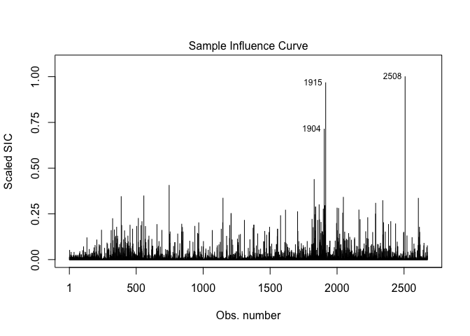

<!-- README.md is generated from README.Rmd. Please edit that file -->

# lmw: Diagnostics for the Implied Weights of Linear Regression

<!--  -->

## <!-- [](https://cran.r-project.org/package=lmw) [](https://cran.r-project.org/package=lmw) -->

### Overview

`lmw` computes weights implied by a linear regression model used to
estimate an average treatment effect and provides diagnostics that
incorporate these weights as described in [Chattopadhyay & Zubizarreta
(2021)](https://arxiv.org/abs/2104.06581). The treatment effect
resulting from this model can be represented as a difference between the
weighted outcome means in the treatment groups, similar to inverse
probability weighting.

The weights implied by the regression model have several interesting
characteristics: they yield exact mean balance between the treatment
groups for every covariate included in the model, they have minimum
variance among all weights that do so, and they may be negative. Despite
yielding exact mean balance between treatment groups, they may not yield
balance between the treatment groups and the target population
corresponding to the desired estimand; in addition, the negative weights
they produce indicate extrapolation beyond the support of the covariate.
`lmw` provides tools to compute the implied weights and perform
diagnostics to assess balance, extrapolation, influence, and
distributional properties of the weights. In addition, `lmw` provides
tools to estimate average treatment effects from the specified models
that correspond to selected target populations.

Below is an example of the use of `lmw` to obtain and evaluate
regression weights for estimating the average treatment effect on the
treated (ATT) of a job training program on earnings using the Lalonde
dataset (see `help("lalonde", package = "lmw")` for details). Here, the
treatment variable is `treat`, the outcome is `re78` (1978 earnings) and
`age`, `educ`, `race`, `married`, `nodegree`, `re74`, and `re75` are
pretreatment covariates.

``` r
#Load lmw and the data
library("lmw")
data("lalonde")

#Estimate the weights
lmw.out <- lmw(~ treat + age + educ + race + married + nodegree + re74 + re75,
               data = lalonde, treat = "treat", estimand = "ATT", method = "URI")
```

`lmw.out` contains the implied regression weights. We can see that the
weighted outcome mean difference between the treatment groups is equal
to the coefficient on the treatment in the corresponding outcome
regression model:

``` r
#The weighted difference in means
w <- lmw.out$weights
with(lalonde, 
     weighted.mean(re78[treat == 1], w[treat == 1]) - 
       weighted.mean(re78[treat == 0], w[treat == 0]))
```

    #> [1] 1548.244

``` r
#The coefficient in the corresponding outcome model
fit <- lm(re78 ~ treat + age + educ + race + married + nodegree + re74 + re75,
               data = lalonde)
coef(fit)["treat"]
```

    #>    treat 
    #> 1548.244

How well do the weights do at balancing the treatment groups to the
target population (in the case, the treated sample)?

``` r
(s <- summary(lmw.out))
```

    #> 
    #> Call:
    #> lmw(formula = ~treat + age + educ + race + married + nodegree + 
    #>     re74 + re75, data = lalonde, estimand = "ATT", method = "URI", 
    #>     treat = "treat")
    #> 
    #> Summary of Balance for Unweighted Data:
    #>               SMD TSMD Control TSMD Treated    KS TKS Control TKS Treated
    #> age        -0.309        0.309            0 0.158       0.158           0
    #> educ        0.055       -0.055            0 0.111       0.111           0
    #> raceblack   1.762       -1.762            0 0.640       0.640           0
    #> racehispan -0.350        0.350            0 0.083       0.083           0
    #> racewhite  -1.882        1.882            0 0.558       0.558           0
    #> married    -0.826        0.826            0 0.324       0.324           0
    #> nodegree    0.245       -0.245            0 0.111       0.111           0
    #> re74       -0.721        0.721            0 0.447       0.447           0
    #> re75       -0.290        0.290            0 0.288       0.288           0
    #> 
    #> Summary of Balance for Weighted Data:
    #>            SMD TSMD Control TSMD Treated    KS TKS Control TKS Treated
    #> age          0       -0.026       -0.026 0.263       0.255       0.030
    #> educ         0        0.005        0.005 0.045       0.047       0.039
    #> raceblack    0       -0.428       -0.428 0.000       0.156       0.156
    #> racehispan   0        0.223        0.223 0.000       0.053       0.053
    #> racewhite    0        0.347        0.347 0.000       0.103       0.103
    #> married      0        0.083        0.083 0.000       0.033       0.033
    #> nodegree     0       -0.087       -0.087 0.000       0.039       0.039
    #> re74         0        0.061        0.061 0.257       0.282       0.036
    #> re75         0        0.044        0.044 0.135       0.166       0.031
    #> 
    #> Effective Sample Sizes:
    #>          Control Treated
    #> All       429.    185.  
    #> Weighted  162.61  153.97

The `SMD` column contains the standardized mean differences for each
covariate between the treatment groups; after weighting, the values are
all equal to zero because of the properties of the implied regression
weights. However, the difference between each treatment group and target
sample remain, as displayed in the `TSMD Treated` and `TSMD Control`
columns, which contain the standardized mean differences between each
treatment group and the target sample (which in this case is the treated
group because the ATT was requested).

We can summarize this balance table in a plot:

``` r
plot(s)
```


We can examine the distribution of weights to see to what degree
negative weights are present:

``` r
plot(lmw.out, type = "weights")
```


Negative weights are present in the control group.

We can further examine extrapolation for specific covariates:

``` r
plot(lmw.out, type = "extrapolation", var = ~married + re75)
```


The × indicates the mean of the covariate in the target population (the
treated group), and the vertical line indicates the mean of the
covariate weighted by the implied regression weights. For these
covariates, the implied regression weights yield a sample fairly
representative of the target population.

We can examine how influential individual points are using their sample
influence curves, which are a function of their residuals, leverages,
and implied weights:

``` r
plot(lmw.out, type = "influence", outcome = re78)
```



Finally, we can fit the outcome model and extract the average treatment
effecy estimates:

``` r
lmw.fit <- lmw_est(lmw.out, outcome = re78)

summary(lmw.fit)
```

    #> 
    #> Effect estimates:
    #>              Estimate Std. Error 95% CI L 95% CI U t value Pr(>|t|)  
    #> E[Y₁-Y₀|A=1]  1548.24     749.99    75.35  3021.14   2.064   0.0394 *
    #> ---
    #> Signif. codes:  0 '***' 0.001 '**' 0.01 '*' 0.05 '.' 0.1 ' ' 1
    #> 
    #> Residual standard error: 6948 on 604 degrees of freedom

In addition, `lmw` can be used with multi-category treatments, two-stage
least squares estimation of instrumental variable models, and
double-robust estimators by interfacing with the `MatchIt` and
`WeightIt` packages to implement these diagnostics for regression in a
matched or weighted sample.
