`lmw` functionality
================

This document illustrates the functionality of the `lmw` package. It is
not meant to be a vignette for users.

We use the `lalonde` dataset from `MatchIt`, which must be installed
(but doesn’t have to be attached).

``` r
library(lmw)
data("lalonde", package = "MatchIt")
```

## A complete workflow for estimating the ATT

We begin using URI weights. The estimand does not affect the calculation
of the weights or treatment effect for URI weights when there are no
treatment-by-covariate interactions in the model. Otherwise, covariates
are centered in the target population implied by the estimand, which
affects the assessment of balance and representativeness and the
estimates of the counterfactual means. Therefore, `estimand` should
always be specified.

``` r
lmw.out1 <- lmw(~treat + age + educ + race + married + nodegree + re74 + re75,
               data = lalonde, type = "URI", estimand = "ATT", treat = "treat")
lmw.out1
```

    ## An lmw object
    ##  - treatment: treat (2 levels)
    ##  - type: URI (uni-regression imputation)
    ##  - number of obs.: 614
    ##  - sampling weights: none
    ##  - base weights: none
    ##  - target estimand: ATT
    ##  - covariates: age, educ, race, married, nodegree, re74, re75

We can assess balance using `summary()`. The output is very similar to
`MatchIt`’s `summary.matchit()`. Here we save the output to a variable
`s.out` which we will use for plotting subsequently. We add `age^2` as a
covariate to illustrate balance for variables not included in the
regression.

``` r
(s.out1 <- summary(lmw.out1, addlvariables = ~I(age^2)))
```

    ## 
    ## Call:
    ## lmw(formula = ~treat + age + educ + race + married + nodegree + 
    ##     re74 + re75, data = lalonde, type = "URI", estimand = "ATT", 
    ##     treat = "treat")
    ## 
    ## Summary of Balance for Unweighted Data:
    ##                SMD TSMD Control TSMD Treated     KS TKS Control TKS Treated
    ## age        -0.3094       0.3094            0 0.1577      0.1577           0
    ## educ        0.0550      -0.0550            0 0.1114      0.1114           0
    ## raceblack   1.7615      -1.7615            0 0.6404      0.6404           0
    ## racehispan -0.3498       0.3498            0 0.0827      0.0827           0
    ## racewhite  -1.8819       1.8819            0 0.5577      0.5577           0
    ## married    -0.8263       0.8263            0 0.3236      0.3236           0
    ## nodegree    0.2450      -0.2450            0 0.1114      0.1114           0
    ## re74       -0.7211       0.7211            0 0.4470      0.4470           0
    ## re75       -0.2903       0.2903            0 0.2876      0.2876           0
    ## I(age^2)   -0.4276       0.4276            0 0.1577      0.1577           0
    ## 
    ## Summary of Balance for Weighted Data:
    ##               SMD TSMD Control TSMD Treated     KS TKS Control TKS Treated
    ## age        -0.000      -0.0262      -0.0262 0.2625      0.2547      0.0296
    ## educ       -0.000       0.0054       0.0054 0.0447      0.0472      0.0395
    ## raceblack  -0.000      -0.4280      -0.4280 0.0000      0.1556      0.1556
    ## racehispan  0.000       0.2234       0.2234 0.0000      0.0528      0.0528
    ## racewhite   0.000       0.3468       0.3468 0.0000      0.1028      0.1028
    ## married    -0.000       0.0834       0.0834 0.0000      0.0326      0.0326
    ## nodegree   -0.000      -0.0869      -0.0869 0.0000      0.0395      0.0395
    ## re74        0.000       0.0610       0.0610 0.2568      0.2820      0.0360
    ## re75       -0.000       0.0436       0.0436 0.1349      0.1661      0.0312
    ## I(age^2)   -0.155       0.1261      -0.0289 0.2625      0.2547      0.0296
    ## 
    ## Effective Sample Sizes:
    ##          Control Treated
    ## All       429.    185.  
    ## Weighted  162.61  153.97

The columns contain the SMD, the target SMDs for each treatment group,
the KS statistics, and the target KS statistics for each group (i.e.,
the KS statistics between each group and the target group, which is
determined by the estimand). It might be a good idea to produce the
means, but I didn’t want to overcrowd the output. We can possibly add
the means as an additional option requested by the user or remove some
of the currently displayed statistics.

TSMD Treated and TKS treated will always be 0 before weighting when
`estimand = "ATT"`. For variables included in the regression model, the
SMD will always be 0 after weighting and the TSMD Treated will equal the
negative of TSMD Control. This is not the case for the additional
variables, though.

We can plot the balance statistics using `plot()`.

``` r
plot(s.out1, layout = "h")
```

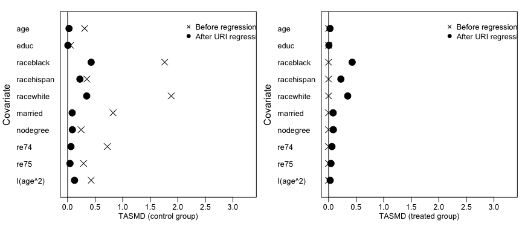<!-- -->

There are several ways to customize this plot. Threshold lines can be
added. The statistics to be displayed can be changed to any of the ones
available in the `summary()` output, making it straightforward to
request a plot of SMDs by using `plot(s.out, stat = "SMD")`. The plots
can be arranged vertically or horizontally. The statistics can be
displayed in absolute value or not. The variables can be ordered in
different ways.

We can examine the distribution of weights using `plot()` on the `lmw`
object:

``` r
plot(lmw.out1, type = "weights")
```

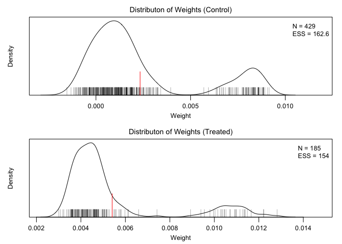<!-- -->

The red line is the mean of the weights and the small vertical black
lines are a rug plot of the weights. These can be suppressed using the
`mean` and `rug` arguments. We can see some small negative weights for
the control units but all weights are positive for the treated units.
The sample size and ESS are printed as well.

We can examine represenativeness and extrapolation using `plot()`. We
must specify one or more variables to assess using the `var` argument.
It is possible to supply variables other than those used in computing
the weights.

``` r
plot(lmw.out1, type = "extrapolation", var = ~ age + race)
```

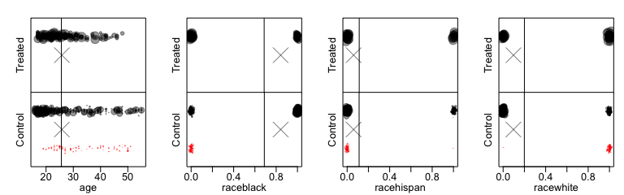<!-- -->

Factor variables have their levels automatically expanded. The line
represents the weighted mean of the variable and the X represents the
target mean. We can see that `age` is well represented, but `raceblack`
is less so, consistent with the TSMD statistics above.

Finally, when we have an outcome variable selected, we can look at the
influence of the observations. This involves fitting the outcome
regression model and computing the residuals, but we will not see the
outcome model until later.

``` r
plot(lmw.out1, type = "influence", outcome = re78)
```

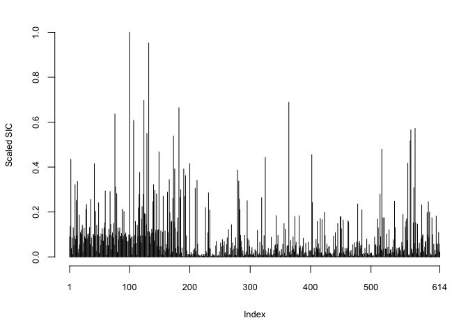<!-- -->

The plot shows indices on the x-axis and scaled SIC on the y-axis. In
this dataset, the first 185 units are treated and the remaining are
control, and this can be seen in the differences in SIC in the plot.

The `outcome` argument can be supplied as a string (e.g., `"re78"`) or
as a variable itself that is present in the original dataset, as above.
This make it easy to specify transformations of the outcome (e.g.,
`sqrt(re78)`) without requiring a new variable in the dataset. This is
known as non-standard evaluation, and is the same method `lm()` uses
when `weights` are supplied and `dplyr` and other `tidyverse` functions
use. This makes it easier for users but it becomes slightly harder to do
programming. This is more pronounced with `lmw_est()`, which uses the
same syntax. An alternative is to include the outcome in the model
formula supplied to `lmw()`, which will then be carried through to other
functions that make use of it, even though `lmw()` itself does not.

We can can extract the influence values now if we wanted to observe them
more directly.

``` r
infl <- influence(lmw.out1, outcome = re78)
str(infl)
```

    ## List of 3
    ##  $ hat   : num [1:614] 0.01826 0.02403 0.01097 0.00843 0.00865 ...
    ##  $ wt.res: num [1:614] 3966 -2699 19299 2078 -4004 ...
    ##  $ sic   : num [1:614] 0.0898 0.1355 0.4343 0.0372 0.0838 ...

``` r
summary(infl$sic)
```

    ##      Min.   1st Qu.    Median      Mean   3rd Qu.      Max. 
    ## 0.0000318 0.0123552 0.0455548 0.0883587 0.1067187 1.0000000

We can now fit the outcome regression model to estimate the treatment
effect using `lmw_est()`. This fits the regression model using the
centered covariates and produces an object similar to the output of
`lm.fit()`. The user should not interact with this object too much, but
rather should use `summary()` to extract the treatment effects.

``` r
lmw.fit1 <- lmw_est(lmw.out1, outcome = re78)

lmw.fit1
```

    ## An lmw_est object
    ##  - outcome: re78 
    ##  - standard errors: robust (HC3) 
    ##  - estimand: ATT 
    ##  - type: URI 
    ## 
    ## Use summary() to examine estimates, standard errors, p-values, and confidence intervals.

Unlike `lm()` outputs, `lmw_est()` computes the coefficient covariance
matrix. It uses HC3 robust standard errors by default, but the type of
SEs are controlled by the `robust` argument, which takes inspiration
from `jtools::summ()`. The outcome is specified using the non-standard
evaluation input as done previously, but it is also possible instead to
supply it as a string (e.g., `"re78"`); this is true for `plot()` and
`influence()` as well.

`summary()` should be used to compute the potential outcome means and
treatment effect and their standard errors and confidence intervals.

``` r
summary(lmw.fit1)
```

    ## 
    ## Effect estimates:
    ##              Estimate Std. Error 95% CI L 95% CI U t value Pr(>|t|)  
    ## E[Y₁-Y₀|A=1]  1548.24     749.99    75.35  3021.14   2.064   0.0394 *
    ## ---
    ## Signif. codes:  0 '***' 0.001 '**' 0.01 '*' 0.05 '.' 0.1 ' ' 1
    ## 
    ## Residual standard error: 6948 on 604 degrees of freedom

Note that estimates for the other coefficients are not included in the
output because users should not report or interpret them, but they can
be requested by setting `model = TRUE`, which produces the same output
that `summary()` produces when used on an `lm` object.

Note that the label for the treatment effect estimate corresponds to the
estimand. Subscripts for 0 and 1 make the labels easy to read.

## Estimating the ATE using MRI

Here we estimate the ATE using an MRI model.

``` r
lmw.out2 <- lmw(~treat + age + educ + race + married + nodegree + re74 + re75,
               data = lalonde, type = "MRI", estimand = "ATE", treat = "treat")
lmw.out2
```

    ## An lmw object
    ##  - treatment: treat (2 levels)
    ##  - type:  MRI (multi-regression imputation)
    ##  - number of obs.: 614
    ##  - sampling weights: none
    ##  - base weights: none
    ##  - target estimand: ATE
    ##  - covariates: age, educ, race, married, nodegree, re74, re75

We can assess balance using `summary()`:

``` r
summary(lmw.out2, addlvariables = ~I(age^2))
```

    ## 
    ## Call:
    ## lmw(formula = ~treat + age + educ + race + married + nodegree + 
    ##     re74 + re75, data = lalonde, type = "MRI", estimand = "ATE", 
    ##     treat = "treat")
    ## 
    ## Summary of Balance for Unweighted Data:
    ##                SMD TSMD Control TSMD Treated     KS TKS Control TKS Treated
    ## age        -0.2419       0.0729      -0.1690 0.1577      0.0475      0.1102
    ## educ        0.0448      -0.0135       0.0313 0.1114      0.0336      0.0778
    ## raceblack   1.6708      -0.5034       1.1674 0.6404      0.1930      0.4475
    ## racehispan -0.2774       0.0836      -0.1938 0.0827      0.0249      0.0578
    ## racewhite  -1.4080       0.4242      -0.9838 0.5577      0.1680      0.3897
    ## married    -0.7208       0.2172      -0.5036 0.3236      0.0975      0.2261
    ## nodegree    0.2355      -0.0710       0.1645 0.1114      0.0336      0.0778
    ## re74       -0.5958       0.1795      -0.4162 0.4470      0.1347      0.3123
    ## re75       -0.2870       0.0865      -0.2005 0.2876      0.0867      0.2010
    ## I(age^2)   -0.3120       0.0940      -0.2180 0.1577      0.0475      0.1102
    ## 
    ## Summary of Balance for Weighted Data:
    ##                SMD TSMD Control TSMD Treated     KS TKS Control TKS Treated
    ## age         0.0000       0.0000       0.0000 0.2449      0.0833      0.1616
    ## educ        0.0000       0.0000       0.0000 0.0548      0.0126      0.0425
    ## raceblack   0.0000       0.0000       0.0000 0.0000      0.0000      0.0000
    ## racehispan  0.0000       0.0000       0.0000 0.0000      0.0000      0.0000
    ## racewhite   0.0000       0.0000       0.0000 0.0000      0.0000      0.0000
    ## married     0.0000       0.0000       0.0000 0.0000      0.0000      0.0000
    ## nodegree    0.0000       0.0000       0.0000 0.0000      0.0000      0.0000
    ## re74        0.0000       0.0000       0.0000 0.2639      0.0754      0.1885
    ## re75        0.0000       0.0000       0.0000 0.1188      0.0400      0.0788
    ## I(age^2)   -0.1104       0.0371      -0.0732 0.2449      0.0833      0.1616
    ## 
    ## Effective Sample Sizes:
    ##          Control Treated
    ## All       429.    185.  
    ## Weighted  343.49   51.57

Unlike with the ATT, the TSMD before weighting for the neither group is
zero because the target group is the full sample, not just the treated
group. After weighting, SMDs and TSMDs are zero for the covariates
included in computing the MRI weights.

Finally, we can fit the outcome model and examine the treatment effect:

``` r
lmw.fit2 <- lmw_est(lmw.out2, outcome = re78)
lmw.fit2
```

    ## An lmw_est object
    ##  - outcome: re78 
    ##  - standard errors: robust (HC3) 
    ##  - estimand: ATE 
    ##  - type: MRI 
    ## 
    ## Use summary() to examine estimates, standard errors, p-values, and confidence intervals.

``` r
summary(lmw.fit2)
```

    ## 
    ## Effect estimates:
    ##          Estimate Std. Error 95% CI L 95% CI U t value Pr(>|t|)
    ## E[Y₁-Y₀]     1075       1336    -1549     3699   0.804    0.421
    ## 
    ## Residual standard error: 6904 on 596 degrees of freedom
    ## 
    ## Potential outcome means:
    ##       Estimate Std. Error 95% CI L 95% CI U t value Pr(>|t|)    
    ## E[Y₀]     6296        338     5632     6960  18.627  < 2e-16 ***
    ## E[Y₁]     7371       1293     4832     9910   5.702 1.86e-08 ***
    ## ---
    ## Signif. codes:  0 '***' 0.001 '**' 0.01 '*' 0.05 '.' 0.1 ' ' 1

Unlike for URI regression, with MRI regression `summary()` produces the
estimated potential outcome means in addition to the treatment effect.
Note that the labels for the estimates correspond to the estimand.

An alternative way to produce estimates without including the outcome in
the call to `lmw_est()` is to include the outcome in the model formula
supplied to `lwm()`, as previously mentioned:

``` r
lmw.out2 <- lmw(re78 ~ treat + age + educ + race + married + nodegree + re74 + re75,
               data = lalonde, type = "MRI", estimand = "ATE", treat = "treat")
lmw.fit2 <- lmw_est(lmw.out2)
summary(lmw.fit2)
```

    ## 
    ## Effect estimates:
    ##          Estimate Std. Error 95% CI L 95% CI U t value Pr(>|t|)
    ## E[Y₁-Y₀]     1075       1336    -1549     3699   0.804    0.421
    ## 
    ## Residual standard error: 6904 on 596 degrees of freedom
    ## 
    ## Potential outcome means:
    ##       Estimate Std. Error 95% CI L 95% CI U t value Pr(>|t|)    
    ## E[Y₀]     6296        338     5632     6960  18.627  < 2e-16 ***
    ## E[Y₁]     7371       1293     4832     9910   5.702 1.86e-08 ***
    ## ---
    ## Signif. codes:  0 '***' 0.001 '**' 0.01 '*' 0.05 '.' 0.1 ' ' 1

This produces the same results but may be easier for users. It is not
the recommended syntax, however, because it less clearly distinguishes
between the design and analysis phases.

## An example using regression after matching

Here we use regression after matching to estimate the ATT. We use
`MatchIt`, which has integration with `lmw`. Here we use nearest
neighbor propensity score matching with an exact matching constraint on
`married` and `nodegree`.

``` r
m.out <- MatchIt::matchit(treat ~ age + educ + race + married + nodegree + re74 + re75,
                          data = lalonde, method = "nearest", estimand = "ATT",
                          exact = ~married + nodegree)

m.out
```

    ## A matchit object
    ##  - method: 1:1 nearest neighbor matching without replacement
    ##  - distance: Propensity score
    ##              - estimated with logistic regression
    ##  - number of obs.: 614 (original), 370 (matched)
    ##  - target estimand: ATT
    ##  - covariates: age, educ, race, married, nodegree, re74, re75

We can supply the `matchit` object to the `obj` argument of `lmw()`.
This will enable the use of some information from the original
`matchit()` call, including the name of the treatment variable, the
dataset, and the estimand, none of which need to be re-supplied to
`lmw()` (although it is generally safer to do so). The `matchit` object
also supplies the matching weights as base weights, which can also be
supplied manually to the `base.weights` argument.

``` r
lmw.out.m <- lmw(~treat + age + educ + race + married + nodegree + re74 + re75,
                 obj = m.out, type = "URI")
lmw.out.m
```

    ## An lmw object
    ##  - treatment: treat (2 levels)
    ##  - type: URI (uni-regression imputation)
    ##  - number of obs.: 614
    ##  - sampling weights: none
    ##  - base weights: matching weights from MatchIt
    ##  - target estimand: ATT
    ##  - covariates: age, educ, race, married, nodegree, re74, re75

When we run `summary()` on the output, we get balance information not
only for the unweighted and regression-weighted sample but also for the
sample weighted by just the matching (i.e., base) weights.

``` r
(s.m <- summary(lmw.out.m))
```

    ## 
    ## Call:
    ## lmw(formula = ~treat + age + educ + race + married + nodegree + 
    ##     re74 + re75, type = "URI", obj = m.out)
    ## 
    ## Summary of Balance for Unweighted Data:
    ##                SMD TSMD Control TSMD Treated     KS TKS Control TKS Treated
    ## age        -0.3094       0.3094            0 0.1577      0.1577           0
    ## educ        0.0550      -0.0550            0 0.1114      0.1114           0
    ## raceblack   1.7615      -1.7615            0 0.6404      0.6404           0
    ## racehispan -0.3498       0.3498            0 0.0827      0.0827           0
    ## racewhite  -1.8819       1.8819            0 0.5577      0.5577           0
    ## married    -0.8263       0.8263            0 0.3236      0.3236           0
    ## nodegree    0.2450      -0.2450            0 0.1114      0.1114           0
    ## re74       -0.7211       0.7211            0 0.4470      0.4470           0
    ## re75       -0.2903       0.2903            0 0.2876      0.2876           0
    ## 
    ## Summary of Balance for Base Weighted Data:
    ##                SMD TSMD Control TSMD Treated     KS TKS Control TKS Treated
    ## age         0.1216      -0.1216            0 0.2757      0.2757           0
    ## educ        0.0081      -0.0081            0 0.0541      0.0541           0
    ## raceblack   1.1151      -1.1151            0 0.4054      0.4054           0
    ## racehispan -0.7314       0.7314            0 0.1730      0.1730           0
    ## racewhite  -0.7843       0.7843            0 0.2324      0.2324           0
    ## married     0.0000       0.0000            0 0.0000      0.0000           0
    ## nodegree    0.0000       0.0000            0 0.0000      0.0000           0
    ## re74       -0.0908       0.0908            0 0.2757      0.2757           0
    ## re75       -0.0515       0.0515            0 0.2108      0.2108           0
    ## 
    ## Summary of Balance for Weighted Data:
    ##            SMD TSMD Control TSMD Treated     KS TKS Control TKS Treated
    ## age         -0      -0.0476      -0.0476 0.2686      0.2725      0.0351
    ## educ        -0      -0.0215      -0.0215 0.0546      0.0535      0.0236
    ## raceblack    0      -0.3995      -0.3995 0.0000      0.1452      0.1452
    ## racehispan  -0       0.2364       0.2364 0.0000      0.0559      0.0559
    ## racewhite   -0       0.3014       0.3014 0.0000      0.0893      0.0893
    ## married      0       0.0215       0.0215 0.0000      0.0084      0.0084
    ## nodegree    -0      -0.0417      -0.0417 0.0000      0.0189      0.0189
    ## re74         0       0.0790       0.0790 0.2273      0.2577      0.0396
    ## re75        -0       0.0383       0.0383 0.1263      0.1582      0.0318
    ## 
    ## Effective Sample Sizes:
    ##               Control Treated
    ## All            429.    185.  
    ## Base weighted  185.    185.  
    ## Weighted       143.75  157.62

We can see that the URI regression has generally improved balance after
matching but has made target balance slightly worse for some of the
variables. Plotting the summary in a Love plot highlights the
trade-offs:

``` r
plot(s.m, layout = "h")
```

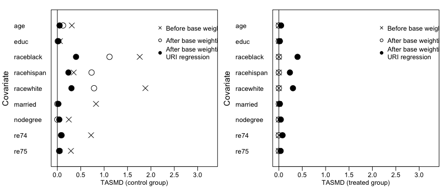<!-- -->

All the other plotting functions (i.e., using `plot.lmw()`) produce the
output as when used without base weights; only statistics for the
variables after regression weighting are displayed.

Finally, we can estimate the treatment effect in the matched sample with
URI regression using `lmw_est()`. Because we performed matching, it is
best to use a cluster-robust standard error with `subclass` (which
represents matched pair membership) included as the clustering variable.

``` r
lmw.fit.m <- lmw_est(lmw.out.m, outcome = re78, cluster = ~subclass)

lmw.fit.m
```

    ## An lmw_est object
    ##  - outcome: re78 
    ##  - standard errors: cluster robust (HC1) 
    ##  - estimand: ATT 
    ##  - type: URI 
    ## 
    ## Use summary() to examine estimates, standard errors, p-values, and confidence intervals.

``` r
summary(lmw.fit.m)
```

    ## 
    ## Effect estimates:
    ##              Estimate Std. Error 95% CI L 95% CI U t value Pr(>|t|)
    ## E[Y₁-Y₀|A=1]   1187.7      727.4   -242.8   2618.2   1.633    0.103
    ## 
    ## Residual standard error: 6959 on 360 degrees of freedom

The outcome `re78` and pair membership variable `subclass` come from the
output of `MatchItIt::match.data()`, which is called internally and
produces a matched dataset from the `matchit` object.

The same results as above could be generated by manually supplying
variables to `lmw()`, as below:

``` r
md.out <- MatchIt::match.data(m.out, drop.unmatched = FALSE)

lmw.out.m2 <- lmw(~treat + age + educ + race + married + nodegree + re74 + re75,
                  data = md.out, type = "URI", estimand = "ATT", treat = "treat",
                  base.weights = md.out$weights)

lmw.fit.m2 <- lmw_est(lmw.out.m2, outcome = re78, cluster = ~subclass)

all.equal(coef(summary(lmw.fit.m)), 
          coef(summary(lmw.fit.m2)))
```

    ## [1] TRUE

## Estimating a CATE

We can estimate a conditional ATE (CATE) by supplying a target unit.
This works by centering the covariates at the target unit’s covariate
values. We will use MRI here since that makes more sense for computing
the CATE.

``` r
target <- list(age = 30, educ = 12, race = "hispan", married = 1, 
               nodegree = 0, re74 = 8000, re75 = 8000)
lmw.out.cate <- lmw(~treat + age + educ + race + married + nodegree + re74 + re75,
                    data = lalonde, type = "MRI", estimand = "CATE", treat = "treat",
                    target = target)
lmw.out.cate
```

    ## An lmw object
    ##  - treatment: treat (2 levels)
    ##  - type:  MRI (multi-regression imputation)
    ##  - number of obs.: 614
    ##  - sampling weights: none
    ##  - base weights: none
    ##  - target estimand: CATE
    ##  - covariates: age, educ, race, married, nodegree, re74, re75

We can assess balance and view the ESS:

``` r
summary(lmw.out.cate)
```

    ## 
    ## Call:
    ## lmw(formula = ~treat + age + educ + race + married + nodegree + 
    ##     re74 + re75, data = lalonde, type = "MRI", estimand = "CATE", 
    ##     treat = "treat", target = target)
    ## 
    ## Summary of Balance for Unweighted Data:
    ##                SMD TSMD Control TSMD Treated     KS TKS Control TKS Treated
    ## age        -0.2419      -0.2152      -0.4571 0.1577      0.6550      0.7892
    ## educ        0.0448      -0.7146      -0.6698 0.1114      0.5967      0.7081
    ## raceblack   1.6708       0.5291       2.1999 0.6404      0.2028      0.8432
    ## racehispan -0.2774      -2.8762      -3.1536 0.0827      0.8578      0.9405
    ## racewhite  -1.4080       1.6536       0.2456 0.5577      0.6550      0.0973
    ## married    -0.7208      -1.0850      -1.8057 0.3236      0.4872      0.8108
    ## nodegree    0.2355       1.2618       1.4973 0.1114      0.5967      0.7081
    ## re74       -0.5958      -0.4025      -0.9983 0.4470      0.6923      0.8919
    ## re75       -0.2870      -1.6996      -1.9866 0.2876      0.9301      0.9622
    ## 
    ## Summary of Balance for Weighted Data:
    ##            SMD TSMD Control TSMD Treated     KS TKS Control TKS Treated
    ## age          0            0            0 0.2881      0.6304      0.5754
    ## educ         0            0            0 0.1966      0.2799      0.2241
    ## raceblack    0            0            0 0.0000      0.0000      0.0000
    ## racehispan   0            0            0 0.0000      0.0000      0.0000
    ## racewhite    0            0            0 0.0000      0.0000      0.0000
    ## married      0            0            0 0.0000      0.0000      0.0000
    ## nodegree     0            0            0 0.0000      0.0000      0.0000
    ## re74         0            0            0 0.3053      0.5429      0.5127
    ## re75         0            0            0 0.3262      0.6217      0.6213
    ## 
    ## Effective Sample Sizes:
    ##          Control Treated
    ## All       429.    185.  
    ## Weighted   33.51    7.19

The effective sample size is low because this estimand requires some
degree of extrapolation. We can see this by noting that many of the
weights are negative:

``` r
plot(lmw.out.cate, type = "weights")
```

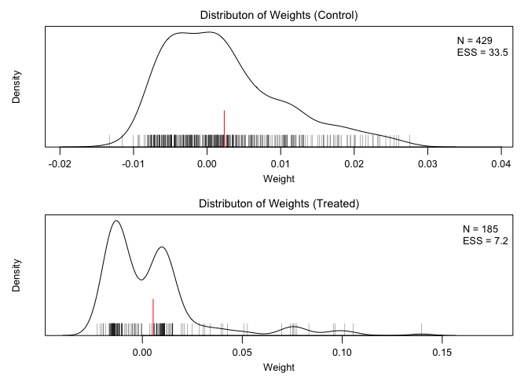<!-- -->

``` r
plot(lmw.out.cate, type = "extrapolation", var = ~age + race)
```

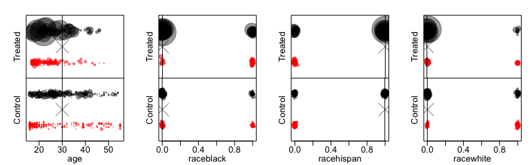<!-- -->

Finally, we can estimate the treatment effect:

``` r
lmw.fit.cate <- lmw_est(lmw.out.cate, outcome = re78)

summary(lmw.fit.cate)
```

    ## 
    ## Effect estimates:
    ##               Estimate Std. Error 95% CI L 95% CI U t value Pr(>|t|)
    ## E[Y₁-Y₀|X=x*]      208       3193    -6062     6479   0.065    0.948
    ## 
    ## Residual standard error: 6904 on 596 degrees of freedom
    ## 
    ## Potential outcome means:
    ##            Estimate Std. Error 95% CI L 95% CI U t value Pr(>|t|)    
    ## E[Y₀|X=x*]    10640       1212     8260    13020   8.781  < 2e-16 ***
    ## E[Y₁|X=x*]    10848       2954     5047    16650   3.672 0.000262 ***
    ## ---
    ## Signif. codes:  0 '***' 0.001 '**' 0.01 '*' 0.05 '.' 0.1 ' ' 1

The labels in the coefficient table make it clear the CATE is being
estimated. Here the standard error is huge because of the degree of
extrapolation required.

## Using `s.weights` to change the estimand

Now we’ll demonstrate the use of `s.weights` to estimate an effect where
the target population is determined by the weights. For this, we’ll
consider caliper matching using `MatchIt`. Unlike before, we cannot
simply supply the `MatchIt` object because doing so will supply the
matching weights as base weights to retain the requested estimand rather
than letting the target population be determined by the matching
weights.

``` r
m.out2 <- MatchIt::matchit(treat ~ age + educ + race + married + nodegree + re74 + re75,
                          data = lalonde, method = "nearest", estimand = "ATT",
                          caliper = .01)

m.out2
```

    ## A matchit object
    ##  - method: 1:1 nearest neighbor matching without replacement
    ##  - distance: Propensity score [caliper]
    ##              - estimated with logistic regression
    ##  - caliper: <distance> (0.003)
    ##  - number of obs.: 614 (original), 168 (matched)
    ##  - target estimand: ATT
    ##  - covariates: age, educ, race, married, nodegree, re74, re75

We supply the resulting weights to the `s.weights` argument of `lmw()`:

``` r
md.out2 <- MatchIt::match.data(m.out2, drop.unmatched = FALSE)

lmw.out.s <- lmw(~treat + age + educ + race + married + nodegree + re74 + re75,
                 data = md.out2, type = "MRI", estimand = "ATE", treat = "treat",
                 s.weights = md.out2$weights)

lmw.out.s
```

    ## An lmw object
    ##  - treatment: treat (2 levels)
    ##  - type:  MRI (multi-regression imputation)
    ##  - number of obs.: 614
    ##  - sampling weights: present
    ##  - base weights: none
    ##  - target estimand: ATE
    ##  - covariates: age, educ, race, married, nodegree, re74, re75

When we assess balance, the sampling weights are incorporated into the
“unadjusted” sample. Because we used caliper matching weights, balance
will appear to be good in the unadjusted sample, again, because it is
after caliper matching.

``` r
summary(lmw.out.s)
```

    ## 
    ## Call:
    ## lmw(formula = ~treat + age + educ + race + married + nodegree + 
    ##     re74 + re75, data = md.out2, type = "MRI", estimand = "ATE", 
    ##     treat = "treat", s.weights = md.out2$weights)
    ## 
    ## Summary of Balance for Unweighted Data:
    ##                SMD TSMD Control TSMD Treated     KS TKS Control TKS Treated
    ## age         0.0132      -0.0066       0.0066 0.2262      0.1131      0.1131
    ## educ       -0.0911       0.0456      -0.0456 0.0714      0.0357      0.0357
    ## raceblack   0.0000       0.0000       0.0000 0.0000      0.0000      0.0000
    ## racehispan  0.0000       0.0000       0.0000 0.0000      0.0000      0.0000
    ## racewhite   0.0000       0.0000       0.0000 0.0000      0.0000      0.0000
    ## married     0.0000       0.0000       0.0000 0.0000      0.0000      0.0000
    ## nodegree    0.0249      -0.0125       0.0125 0.0119      0.0060      0.0060
    ## re74       -0.1575       0.0788      -0.0788 0.2500      0.1250      0.1250
    ## re75       -0.1113       0.0556      -0.0556 0.1905      0.0952      0.0952
    ## 
    ## Summary of Balance for Weighted Data:
    ##            SMD TSMD Control TSMD Treated     KS TKS Control TKS Treated
    ## age          0            0            0 0.2261      0.1171      0.1110
    ## educ         0            0            0 0.0593      0.0285      0.0340
    ## raceblack    0            0            0 0.0000      0.0000      0.0000
    ## racehispan   0            0            0 0.0000      0.0000      0.0000
    ## racewhite    0            0            0 0.0000      0.0000      0.0000
    ## married      0            0            0 0.0000      0.0000      0.0000
    ## nodegree     0            0            0 0.0000      0.0000      0.0000
    ## re74         0            0            0 0.2028      0.1059      0.0969
    ## re75         0            0            0 0.1438      0.0735      0.0703
    ## 
    ## Effective Sample Sizes:
    ##          Control Treated
    ## All        84.     84.  
    ## Weighted   83.36   83.08

Indeed, because balance after matching is so good, the regression
weights do little to adjust the sample, so the effective sample size
after regression is similar to that with just the matching weights
applied. Examining the distribution of weights reveals a similar story:

``` r
plot(lmw.out.s, type = "weights")
```

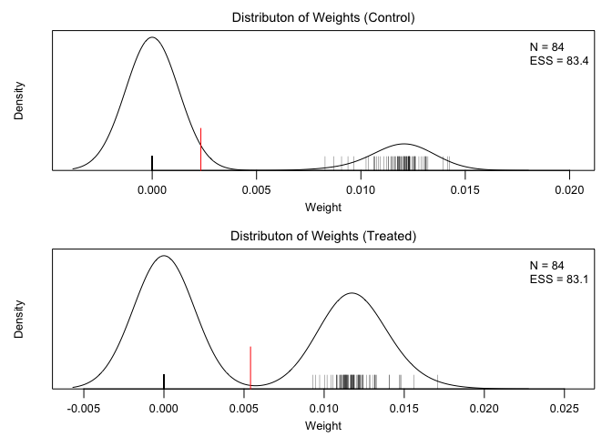<!-- -->

There is a peak at weights of 0 (indicating the units that were dropped
by the matching), and little variability among the nonzero weights; none
of the weights are negative.

We can estimate the treatment effect in the matched data:

``` r
lmw.est.s <- lmw_est(lmw.out.s, outcome = re78, cluster = m.out2$subclass)

lmw.est.s
```

    ## An lmw_est object
    ##  - outcome: re78 
    ##  - standard errors: cluster robust (HC1) 
    ##  - estimand: ATE 
    ##  - type: MRI 
    ## 
    ## Use summary() to examine estimates, standard errors, p-values, and confidence intervals.

``` r
summary(lmw.est.s)
```

    ## 
    ## Effect estimates:
    ##          Estimate Std. Error 95% CI L 95% CI U t value Pr(>|t|)  
    ## E[Y₁-Y₀]   2013.1     1147.4   -254.1   4280.3   1.754   0.0814 .
    ## ---
    ## Signif. codes:  0 '***' 0.001 '**' 0.01 '*' 0.05 '.' 0.1 ' ' 1
    ## 
    ## Residual standard error: 7179 on 150 degrees of freedom
    ## 
    ## Potential outcome means:
    ##       Estimate Std. Error 95% CI L 95% CI U t value Pr(>|t|)    
    ## E[Y₀]   4555.2      624.8   3320.6   5789.8   7.290 1.65e-11 ***
    ## E[Y₁]   6568.3      936.6   4717.7   8418.9   7.013 7.44e-11 ***
    ## ---
    ## Signif. codes:  0 '***' 0.001 '**' 0.01 '*' 0.05 '.' 0.1 ' ' 1

We get a pretty similar result to had we just estimated the treatment
effect without regression:

``` r
md.out2_ <- MatchIt::match.data(m.out2)
lm.est2 <- lm(re78 ~ treat, data = md.out2_, weights = weights)
lmtest::coeftest(lm.est2, vcov = sandwich::vcovCL, cluster = ~subclass)
```

    ## 
    ## t test of coefficients:
    ## 
    ##             Estimate Std. Error t value  Pr(>|t|)    
    ## (Intercept)  4680.31     624.25  7.4974 3.713e-12 ***
    ## treat        1868.19    1128.46  1.6555   0.09971 .  
    ## ---
    ## Signif. codes:  0 '***' 0.001 '**' 0.01 '*' 0.05 '.' 0.1 ' ' 1

In fact, because the covariates were so well balanced, the regression
actually increases the variance of the effect estimate.

## Using propensity score regression

Performing a regression with the propensity score as the sole covariate
is one way to use propensity scores. We can assess balance on covariates
after estimating the implied regression weights from the propensity
score outcome model. We’ll use the propensity score computed in `m.out`,
which is stored as the `distance` component.

``` r
lmw.out.ps <- lmw(~ treat + m.out$distance, data = lalonde, 
                  type = "MRI", estimand = "ATT", treat = "treat")

lmw.out.ps
```

    ## An lmw object
    ##  - treatment: treat (2 levels)
    ##  - type:  MRI (multi-regression imputation)
    ##  - number of obs.: 614
    ##  - sampling weights: none
    ##  - base weights: none
    ##  - target estimand: ATT
    ##  - covariates: m.out$distance

``` r
summary(lmw.out.ps, 
        addlvariables = ~ age + educ + race + married + nodegree + re74 + re75)
```

    ## 
    ## Call:
    ## lmw(formula = ~treat + m.out$distance, data = lalonde, type = "MRI", 
    ##     estimand = "ATT", treat = "treat")
    ## 
    ## Summary of Balance for Unweighted Data:
    ##                    SMD TSMD Control TSMD Treated     KS TKS Control TKS Treated
    ## m.out$distance  1.7941      -1.7941            0 0.6444      0.6444           0
    ## age            -0.3094       0.3094            0 0.1577      0.1577           0
    ## educ            0.0550      -0.0550            0 0.1114      0.1114           0
    ## raceblack       1.7615      -1.7615            0 0.6404      0.6404           0
    ## racehispan     -0.3498       0.3498            0 0.0827      0.0827           0
    ## racewhite      -1.8819       1.8819            0 0.5577      0.5577           0
    ## married        -0.8263       0.8263            0 0.3236      0.3236           0
    ## nodegree        0.2450      -0.2450            0 0.1114      0.1114           0
    ## re74           -0.7211       0.7211            0 0.4470      0.4470           0
    ## re75           -0.2903       0.2903            0 0.2876      0.2876           0
    ## 
    ## Summary of Balance for Weighted Data:
    ##                    SMD TSMD Control TSMD Treated     KS TKS Control TKS Treated
    ## m.out$distance  0.0000       0.0000            0 0.1293      0.1293           0
    ## age             0.1371      -0.1371            0 0.3114      0.3114           0
    ## educ           -0.0075       0.0075            0 0.0385      0.0385           0
    ## raceblack      -0.0296       0.0296           -0 0.0108      0.0108           0
    ## racehispan     -0.1836       0.1836            0 0.0434      0.0434           0
    ## racewhite       0.1828      -0.1828            0 0.0542      0.0542           0
    ## married         0.1050      -0.1050            0 0.0411      0.0411           0
    ## nodegree        0.0615      -0.0615           -0 0.0280      0.0280           0
    ## re74            0.0672      -0.0672            0 0.2323      0.2323           0
    ## re75            0.0030      -0.0030            0 0.1371      0.1371           0
    ## 
    ## Effective Sample Sizes:
    ##          Control Treated
    ## All       429.       185
    ## Weighted  108.01     185

Consistent with theory, conditioning on the propensity score improves
balance on the covariates, though not as well as does conditioning on
the covariates directly.

Balance is even better if we use a polynomial model:

``` r
lmw.out.ps <- lmw(~ treat + poly(m.out$distance, 2), data = lalonde, 
                  type = "MRI", estimand = "ATT", treat = "treat")

summary(lmw.out.ps, 
        addlvariables = ~ age + educ + race + married + nodegree + re74 + re75)
```

    ## 
    ## Call:
    ## lmw(formula = ~treat + poly(m.out$distance, 2), data = lalonde, 
    ##     type = "MRI", estimand = "ATT", treat = "treat")
    ## 
    ## Summary of Balance for Unweighted Data:
    ##                                SMD TSMD Control TSMD Treated     KS TKS Control
    ## `poly(m.out$distance, 2)`1  1.7941      -1.7941            0 0.6444      0.6444
    ## `poly(m.out$distance, 2)`2 -0.0368       0.0368            0 0.1828      0.1828
    ## age                        -0.3094       0.3094            0 0.1577      0.1577
    ## educ                        0.0550      -0.0550            0 0.1114      0.1114
    ## raceblack                   1.7615      -1.7615            0 0.6404      0.6404
    ## racehispan                 -0.3498       0.3498            0 0.0827      0.0827
    ## racewhite                  -1.8819       1.8819            0 0.5577      0.5577
    ## married                    -0.8263       0.8263            0 0.3236      0.3236
    ## nodegree                    0.2450      -0.2450            0 0.1114      0.1114
    ## re74                       -0.7211       0.7211            0 0.4470      0.4470
    ## re75                       -0.2903       0.2903            0 0.2876      0.2876
    ##                            TKS Treated
    ## `poly(m.out$distance, 2)`1           0
    ## `poly(m.out$distance, 2)`2           0
    ## age                                  0
    ## educ                                 0
    ## raceblack                            0
    ## racehispan                           0
    ## racewhite                            0
    ## married                              0
    ## nodegree                             0
    ## re74                                 0
    ## re75                                 0
    ## 
    ## Summary of Balance for Weighted Data:
    ##                                SMD TSMD Control TSMD Treated     KS TKS Control
    ## `poly(m.out$distance, 2)`1  0.0000       0.0000            0 0.1203      0.1203
    ## `poly(m.out$distance, 2)`2  0.0000       0.0000            0 0.1203      0.1203
    ## age                         0.0644      -0.0644            0 0.2881      0.2881
    ## educ                        0.0025      -0.0025            0 0.0402      0.0402
    ## raceblack                  -0.0255       0.0255            0 0.0093      0.0093
    ## racehispan                  0.0700      -0.0700           -0 0.0165      0.0165
    ## racewhite                  -0.0246       0.0246           -0 0.0073      0.0073
    ## married                    -0.0432       0.0432           -0 0.0169      0.0169
    ## nodegree                    0.0705      -0.0705            0 0.0321      0.0321
    ## re74                       -0.0919       0.0919           -0 0.2483      0.2483
    ## re75                       -0.0205       0.0205           -0 0.1373      0.1373
    ##                            TKS Treated
    ## `poly(m.out$distance, 2)`1           0
    ## `poly(m.out$distance, 2)`2           0
    ## age                                  0
    ## educ                                 0
    ## raceblack                            0
    ## racehispan                           0
    ## racewhite                            0
    ## married                              0
    ## nodegree                             0
    ## re74                                 0
    ## re75                                 0
    ## 
    ## Effective Sample Sizes:
    ##          Control Treated
    ## All        429.      185
    ## Weighted   102.6     185

Finally, we can estimate the effect:

``` r
lmw.est.ps <- lmw_est(lmw.out.ps, outcome = re78)

summary(lmw.est.ps)
```

    ## 
    ## Effect estimates:
    ##              Estimate Std. Error 95% CI L 95% CI U t value Pr(>|t|)
    ## E[Y₁-Y₀|A=1]   1068.0      840.8   -583.3   2719.3    1.27    0.205
    ## 
    ## Residual standard error: 7379 on 608 degrees of freedom
    ## 
    ## Potential outcome means:
    ##           Estimate Std. Error 95% CI L 95% CI U t value Pr(>|t|)    
    ## E[Y₀|A=1]   5281.2      604.4   4094.2   6468.1   8.738   <2e-16 ***
    ## E[Y₁|A=1]   6349.1      584.6   5201.1   7497.2  10.861   <2e-16 ***
    ## ---
    ## Signif. codes:  0 '***' 0.001 '**' 0.01 '*' 0.05 '.' 0.1 ' ' 1

## Estimating the effects of a multi-category treatment

Here, we’ll consider the covariate-adjusted effect of `race`, a
3-category variable (`"black"`, `"hispan"`, `"white"`), on `re78`. With
multi-category treatments, some additional inputs may be required.
Although both URI and MRI methods are available for multi-category
treatments, MRI regression is much better and easier to use, so I’ll
demonstrate that now. \[Note: I need help figuring out the URI
weights.\]

If we want to estimate the ATT or ATC, we need to specify which group is
the “focal” treated or control group, respectively; we can do this with
the `focal` argument, which works the same way it does in `WeightIt`.
Here we’ll consider the ATT with respect to “white” as the treated
group.

``` r
lmw.out.multi <- lmw(~race + age + educ + married + re74, data = lalonde,
                     treat = "race", type = "MRI", estimand = "ATT", 
                     focal = "white")
lmw.out.multi
```

    ## An lmw object
    ##  - treatment: race (3 levels)
    ##  - type:  MRI (multi-regression imputation)
    ##  - number of obs.: 614
    ##  - sampling weights: none
    ##  - base weights: none
    ##  - target estimand: ATT
    ##  - covariates: age, educ, married, re74

We can assess balance using `summary()`:

``` r
summary(lmw.out.multi)
```

    ## 
    ## Call:
    ## lmw(formula = ~race + age + educ + married + re74, data = lalonde, 
    ##     type = "MRI", estimand = "ATT", treat = "race", focal = "white")
    ## 
    ## Summary of Balance for Unweighted Data:
    ##         TSMD black TSMD hispan TSMD white TKS black TKS hispan TKS white
    ## age        -0.2582     -0.2670          0    0.1356     0.1382         0
    ## educ       -0.1376     -0.5987          0    0.1503     0.2301         0
    ## married    -0.6919     -0.2436          0    0.3430     0.1208         0
    ## re74       -0.5309     -0.2582          0    0.3649     0.1539         0
    ## 
    ## Summary of Balance for Weighted Data:
    ##         TSMD black TSMD hispan TSMD white TKS black TKS hispan TKS white
    ## age             -0           0         -0    0.1548     0.1524         0
    ## educ             0           0          0    0.0818     0.1010         0
    ## married          0          -0          0    0.0000     0.0000         0
    ## re74             0          -0         -0    0.1528     0.0659         0
    ## 
    ## Effective Sample Sizes:
    ##           black hispan white
    ## All      243.    72.     299
    ## Weighted 123.35  43.25   299

Unlike with binary treatments, only target balance statistics are
produced. Because we are using `"white"` as the focal group, all balance
statistics are with respect to that group. To get balance statistics
that compare pairs of treatment levels with each other, use the
`contrast` argument to supply two treatment levels:

``` r
summary(lmw.out.multi, contrast = c("black", "hispan"))
```

    ## 
    ## Call:
    ## lmw(formula = ~race + age + educ + married + re74, data = lalonde, 
    ##     type = "MRI", estimand = "ATT", treat = "race", focal = "white")
    ## 
    ## Summary of Balance for Unweighted Data:
    ##             SMD TSMD hispan TSMD black     KS TKS hispan TKS black
    ## age      0.0088     -0.2670    -0.2582 0.0556     0.1382    0.1356
    ## educ     0.4612     -0.5987    -0.1376 0.2068     0.2301    0.1503
    ## married -0.4483     -0.2436    -0.6919 0.2222     0.1208    0.3430
    ## re74    -0.2727     -0.2582    -0.5309 0.3035     0.1539    0.3649
    ## 
    ## Summary of Balance for Weighted Data:
    ##         SMD TSMD hispan TSMD black     KS TKS hispan TKS black
    ## age       0           0          0 0.0663     0.1524    0.1548
    ## educ      0           0          0 0.0622     0.1010    0.0818
    ## married   0           0          0 0.0000     0.0000    0.0000
    ## re74      0           0          0 0.1896     0.0659    0.1528
    ## 
    ## Effective Sample Sizes:
    ##          hispan  black
    ## All       72.   243.  
    ## Weighted  43.25 123.35

(In this case this is an odd choice, but when `estimand = "ATE"` it
becomes more useful.)

Plotting functions work the same:

``` r
plot(lmw.out.multi, type = "weights")
```

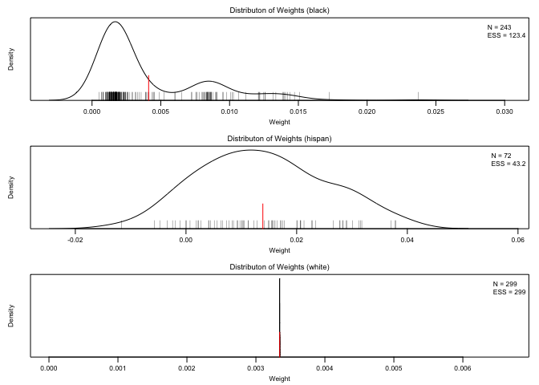<!-- -->

``` r
plot(lmw.out.multi, type = "extrapolation", var = ~ age + married)
```

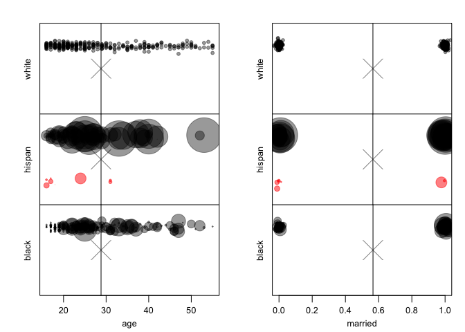<!-- -->

``` r
plot(lmw.out.multi, type = "influence", outcome = re78)
```

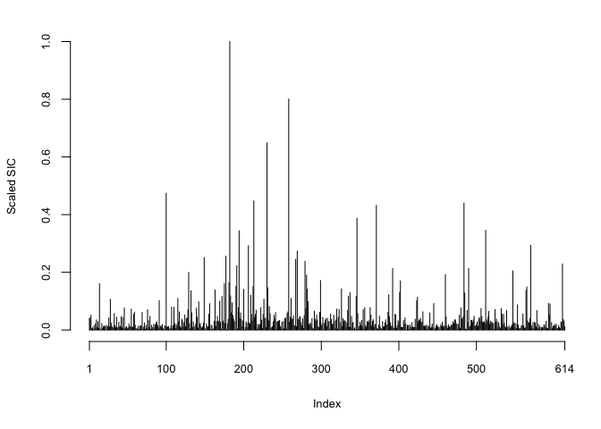<!-- -->

When we estimate treatment effects, all pairwise comparisons and each
counterfactual mean is produced:

``` r
lmw.fit.multi <- lmw_est(lmw.out.multi, outcome = re78)
lmw.fit.multi
```

    ## An lmw_est object
    ##  - outcome: re78 
    ##  - standard errors: robust (HC3) 
    ##  - estimand: ATT 
    ##  - type: MRI 
    ## 
    ## Use summary() to examine estimates, standard errors, p-values, and confidence intervals.

``` r
summary(lmw.fit.multi)
```

    ## 
    ## Effect estimates:
    ##              Estimate Std. Error 95% CI L 95% CI U t value Pr(>|t|)
    ## E[Y₂-Y₁|A=3]   -86.84    1530.97 -3093.55  2919.88  -0.057    0.955
    ## E[Y₃-Y₁|A=3]   939.48     999.54 -1023.55  2902.50   0.940    0.348
    ## E[Y₃-Y₂|A=3]  1026.31    1275.70 -1479.07  3531.70   0.805    0.421
    ## 
    ## Residual standard error: 6904 on 599 degrees of freedom
    ## 
    ## Potential outcome means:
    ##           Estimate Std. Error 95% CI L 95% CI U t value Pr(>|t|)    
    ## E[Y₁|A=3]   6684.6      926.2   4865.7   8503.5   7.218 1.61e-12 ***
    ## E[Y₂|A=3]   6597.8     1219.1   4203.6   8991.9   5.412 9.02e-08 ***
    ## E[Y₃|A=3]   7624.1      375.9   6885.8   8362.4  20.282  < 2e-16 ***
    ## ---
    ## Signif. codes:  0 '***' 0.001 '**' 0.01 '*' 0.05 '.' 0.1 ' ' 1
    ## 
    ## Key: 1 = black; 2 = hispan; 3 = white

A key is displayed at the bottom to identify the label for each
treatment group.

## Estimating a treatment effect using 2SLS

Here we demonstrate computing weights corresponding to a 2SLS IV model.
Only binary treatments with a single instrument are supported, and only
URI regression is supported. We use the `c401k` dataset from the `LARF`
package, which considers the effect of `p401k` on `nettfa` using `e401k`
as an instrument.

``` r
data("c401k", package = "LARF")
```

We use the `lmw_iv()` function, which is similar to `lmw()` except than
additional argument, `iv`, must be supplied containing the name of the
instrument, which should not otherwise appear in the model. The supplied
formula should correspond to the second stage model. Although `estimand`
can be supplied, it only affects the target population in balance
assessment. We will include one covariate (`inc`) in the model; this
covariate is included in the implied first and second stage models.

``` r
lmw.out.iv <- lmw_iv(~p401k + inc, data = c401k, treat = "p401k", iv = "e401k")
lmw.out.iv
```

    ## An lmw_iv object
    ##  - treatment: p401k (2 levels)
    ##  - instrument: e401k
    ##  - type: URI (uni-regression imputation)
    ##  - number of obs.: 9275
    ##  - sampling weights: none
    ##  - base weights: none
    ##  - target estimand: ATE
    ##  - covariates: inc

We can assess balance on the other covariates using the `addlvariables`
argument in `summary()`:

``` r
summary(lmw.out.iv, addlvariables = ~male + marr + age)
```

    ## 
    ## Call:
    ## lmw_iv(formula = ~p401k + inc, data = c401k, treat = "p401k", 
    ##     iv = "e401k")
    ## 
    ## Summary of Balance for Unweighted Data:
    ##          SMD TSMD Control TSMD Treated     KS TKS Control TKS Treated
    ## inc   0.5987      -0.1654       0.4334 0.2860      0.0790      0.2070
    ## male -0.0563       0.0156      -0.0408 0.0225      0.0062      0.0163
    ## marr  0.1948      -0.0538       0.1410 0.0925      0.0256      0.0670
    ## age   0.0592      -0.0164       0.0429 0.0622      0.0172      0.0450
    ## 
    ## Summary of Balance for Weighted Data:
    ##          SMD TSMD Control TSMD Treated     KS TKS Control TKS Treated
    ## inc  -0.0000       0.1421       0.1421 0.1321      0.0555      0.1314
    ## male -0.0289       0.0086      -0.0203 0.0115      0.0034      0.0081
    ## marr -0.0530       0.0982       0.0451 0.0252      0.0466      0.0214
    ## age   0.0105       0.0027       0.0132 0.0664      0.0361      0.0310
    ## 
    ## Effective Sample Sizes:
    ##          Control Treated
    ## All      6713.   2562.  
    ## Weighted 1628.84 2394.23

Because `estimand` is set to `"ATE"` by default, target balance refers
to how representative the weighted sample is of the full sample, which
typically is not the estimand of 2SLS.

If we plot the weights, we can see that the control group has many units
with negative weights:

``` r
plot(lmw.out.iv, type = "weights")
```

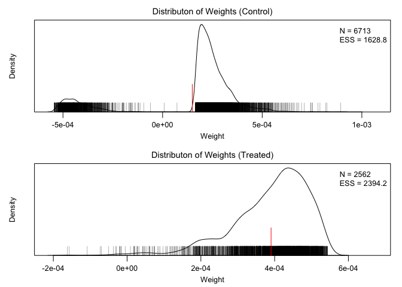<!-- -->

Because the primary component of the plots is the weights, all the
plotting methods work for `lmw.iv` objects just as they do for `lmw`
objects.

We can estimate the treatment effect using `lmw_est()`, which has a
separate method for `lmw.iv` objects. The arguments are the same as for
`lmw` objects. Although the first and second stage models are fit, only
the second stage model results are included in the output, which should
typically not be examined anyway. Instead, we use `summary()` to examine
the treatment effect estimate.

``` r
lmw.fit.iv <- lmw_est(lmw.out.iv, outcome = nettfa)
lmw.fit.iv
```

    ## An lmw_est_iv object
    ##  - outcome: nettfa 
    ##  - standard errors: robust (HC3) 
    ##  - type: URI 
    ## 
    ## Use summary() to examine estimates, standard errors, p-values, and confidence intervals.

``` r
summary(lmw.fit.iv)
```

    ## 
    ## Effect estimates:
    ##          Estimate Std. Error 95% CI L 95% CI U t value Pr(>|t|)    
    ## E[Y₁-Y₀]    8.822      2.253    4.406   13.239   3.916 9.08e-05 ***
    ## ---
    ## Signif. codes:  0 '***' 0.001 '**' 0.01 '*' 0.05 '.' 0.1 ' ' 1
    ## 
    ## Residual standard error: 59.02 on 9272 degrees of freedom

The results agree with `ivreg::ivreg()` when the correct standard error
is used. Sampling weights and base weights can be used with `lmw_iv()`
just as they can be with `lmw()`.

## To Do

Things to improve or fix:

-   URI regression for multi-category treatments; it works, but there
    are some inconsistencies with the weights because of how strange
    they are mathematically
-   AIPW estimation; the weights can be produced, but it is not
    straightforward to estimate the standard errors of the treatment
    effects.
-   Testing and evaluation; making sure results agree with other
    functions like `lm()`, `margins()`, and `ivreg()`
-   Datasets and example; using a strong example dataset to allow a wide
    variety of examples, including for multi-category treatments and
    2SLS
-   Vignettes; vignettes for users
